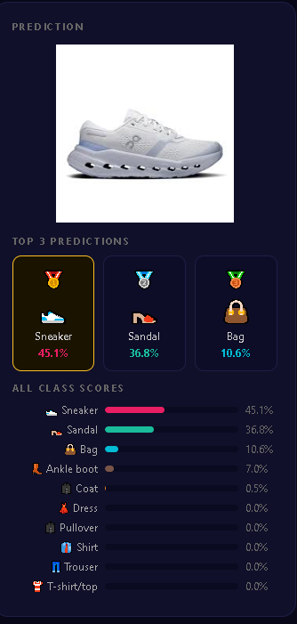
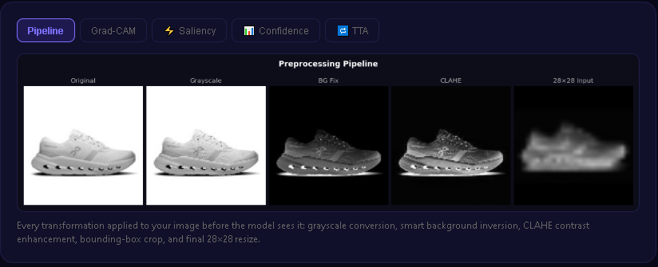
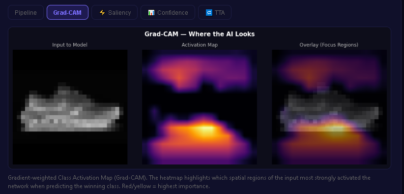
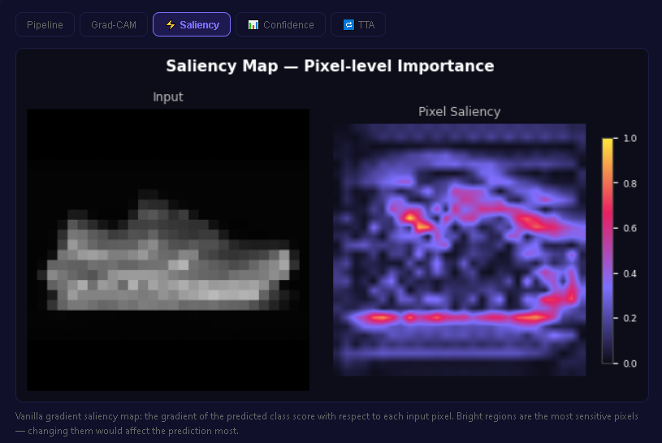
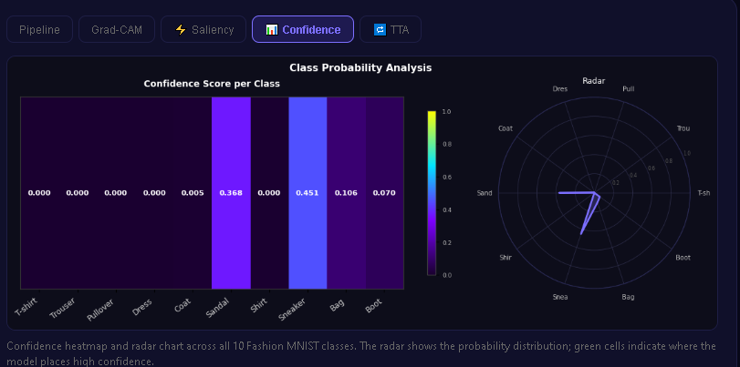
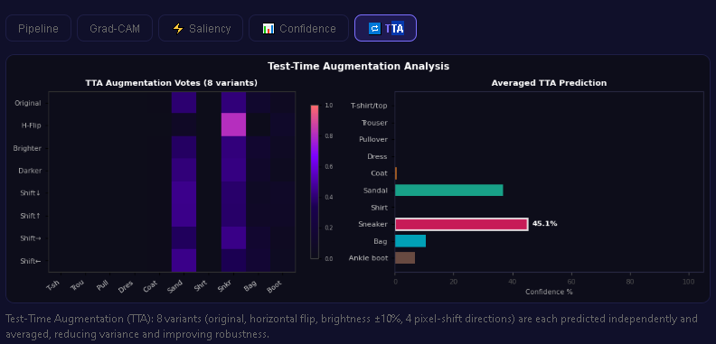

# 🧥 Fashion MNIST Pro
### Aplicație Web de Analiză Vizuală · ResNet Custom · Explainable AI (XAI) · Flask

| | |
|---|---|
| 👤 **Autor** | Mocanu Roberto |
| 🏷️ **Domeniu** | Computer Vision / Deep Learning / Explainable AI |
| 📦 **Framework** | TensorFlow 2.x · Keras 3 · Flask · OpenCV |
| 🗂️ **Dataset** | Fashion MNIST (70.000 imagini, 10 clase) |
| 🌐 **Interfață** | Aplicație Web Flask cu analiză vizuală completă |

Acest proiect reprezintă **un pipeline complet de Computer Vision cu interfață web interactivă**, construit de la zero pe arhitectură reziduală (ResNet). Spre deosebire de soluțiile clasice cu CNN secvențial, propune **preprocesare inteligentă a imaginilor**, **Test-Time Augmentation (TTA)** pentru acuratețe maximă, și un suite complet de **Explainable AI (XAI)** cu Grad-CAM, hărți de saliency, vizualizare pipeline și analiză radar — toate disponibile în timp real prin interfața web.

---

## 🖥️ Interfața Web — Demonstrație Live

### Predicție — Top 3 Clase + Scoruri Complete



*Panoul principal de predicție: imaginea încărcată, **top 3 clase** cu procentaje, și un grafic cu bare pentru toate cele 10 categorii Fashion MNIST. Modelul a clasificat corect un Sneaker cu 45.1% încredere, urmat de Sandal (36.8%) și Bag (10.6%).*

Rezultatele afișate includ:
- 🥇 **Locul 1** — clasa câștigătoare cu procentajul de încredere
- 🥈🥉 **Locul 2 și 3** — alternative plauzibile cu scorurile lor
- **Grafic bare complet** — toate cele 10 categorii vizualizate simultan pentru transparență

---

## 🔬 Analiza Vizuală — 5 Tab-uri Interactive

Interfața web oferă **5 tab-uri de analiză** care explică pas cu pas ce face modelul cu imaginea ta.

---

### Tab 1 · Pipeline — Pașii de Preprocesare



*Fiecare transformare aplicată imaginii înainte ca modelul s-o vadă: conversie grayscale, corecție automată fundal, îmbunătățire contrast CLAHE, crop bounding-box, și resize final la 28×28 pixeli.*

Imaginea parcurge **5 transformări succesive** complet automat:

| Pas | Denumire | Ce face |
|-----|----------|---------|
| 1 | **Original** | Imaginea color încărcată de utilizator |
| 2 | **Grayscale** | Conversie la alb-negru — Fashion MNIST lucrează pe un singur canal |
| 3 | **BG Fix** | Detecție automată fundal: dacă fundalul e alb (pixeli colțuri > 127), imaginea e inversată pentru a respecta convenția Fashion MNIST (obiect alb pe fond negru) |
| 4 | **CLAHE** | Contrast Limited Adaptive Histogram Equalization — îmbunătățire locală a contrastului care scoate în evidență texturile subtile (dantelă, tricot, piele) fără a satura zonele clare |
| 5 | **28×28 Input** | Crop bounding-box (taie marginile goale), pad pătratic, resize la 28×28 — formatul exact așteptat de model |

**De ce CLAHE și nu Histogram Equalization clasic?** CLAHE îmbunătățește contrastul *local* (pe tile-uri de 4×4), nu global — astfel texturile fine rămân vizibile uniform pe toată imaginea.

```python
clahe = cv2.createCLAHE(clipLimit=3.0, tileGridSize=(4, 4))
enhanced = clahe.apply(gray_image)
```

---

### Tab 2 · Grad-CAM — Unde Privește Modelul



*Gradient-weighted Class Activation Map (Grad-CAM). Heatmap-ul evidențiază zonele spațiale din imagine care au activat cel mai puternic rețeaua atunci când a prezis clasa câștigătoare. Roșu/Galben = importanță maximă.*

> **Problema „Black Box"**: Cum știm că modelul recunoaște o gheată uitându-se la *forma ei*, și nu la fundalul sau zgomotul imaginii?

**Grad-CAM** răspunde la această întrebare: calculează gradientul scorului clasei față de feature map-ul ultimului strat convoluțional și generează o hartă termică suprapusă pe imaginea originală.

Formula matematică:
$$\alpha_k^c = \frac{1}{Z} \sum_{i,j} \frac{\partial y^c}{\partial A_{ij}^k} \quad \Rightarrow \quad L^c_{Grad\text{-}CAM} = ReLU\!\left(\sum_k \alpha_k^c \cdot A^k\right)$$

Interpretarea culorilor:
- 🔴 **Roșu/Portocaliu/Galben** — zona care a influențat cel mai mult decizia modelului
- 🔵 **Albastru/Violet/Negru** — zone irelevante pentru clasificare

Cele 3 panouri afișate:
1. **Input to Model** — imaginea preprocesată (28×28, grayscale)
2. **Activation Map** — heatmap-ul brut Grad-CAM, interpolat la dimensiunea originală
3. **Overlay (Focus Regions)** — heatmap suprapus transparent pe imaginea originală

**Provocare tehnică:** Keras 3 nu expune `output_shape` pentru layere subclassed. Soluția implementată folosește un **forward hook** care captează feature map-ul în interiorul contextului `GradientTape`:

```python
captured = []
original_call = hook_layer.__class__.__call__

def hooked_call(self_layer, inputs, *args, **kwargs):
    out = original_call(self_layer, inputs, *args, **kwargs)
    if self_layer is hook_layer:
        captured.append(out)
    return out

hook_layer.__class__.__call__ = hooked_call
x = tf.Variable(img_array)
with tf.GradientTape() as tape:
    preds = model(x, training=False)
    score = preds[:, pred_class_idx]

grads = tape.gradient(score, captured[0])
```

---

### Tab 3 · Saliency — Importanța la Nivel de Pixel



*Vanilla Gradient Saliency Map: gradientul scorului clasei prezise față de fiecare pixel individual al imaginii de intrare. Pixelii roșii/strălucitori sunt cei mai sensibili — modificarea lor ar schimba cel mai mult predicția.*

Spre deosebire de Grad-CAM (care operează la nivel de feature map convoluțional), **Saliency Maps** operează direct la nivel de pixel:

$$S_{ij} = \left| \frac{\partial y^c}{\partial x_{ij}} \right|$$

Interpretare practică:
- **Zone roșii/luminoase** = pixeli critici — dacă i-ai modifica ușor, predicția s-ar schimba
- **Zone albastre/întunecate** = pixeli ignorați de model — pot fi schimbați fără efect

Diferența față de Grad-CAM:
| Metodă | Granularitate | Rezoluție | Util pentru |
|--------|--------------|-----------|-------------|
| **Grad-CAM** | Strat convoluțional | Medie (low-res upscaled) | Regiuni mari de interes |
| **Saliency Map** | Pixel individual | Maximă (28×28 nativ) | Importanța exactă per pixel |

---

### Tab 4 · Confidence — Distribuția Probabilităților pe Toate Clasele



*Heatmap de încredere și grafic radar pentru toate cele 10 clase Fashion MNIST simultan. Celulele galbene/verzi indică unde modelul plasează cea mai mare încredere. Graficul radar arată distribuția probabilităților în format polar.*

Acest tab afișează **două vizualizări complementare** ale aceluiași vector de probabilități:

**Heatmap (stânga):**
- Fiecare coloană = o clasă din Fashion MNIST
- Culoarea = scorul de probabilitate (0.0 → violet, 1.0 → galben)
- Permite compararea directă a scorurilor între clase

**Radar Chart (dreapta):**
- Fiecare ax = o clasă (10 axe în total)
- Suprafața acoperită = distribuția completă a încrederii modelului
- O suprafață concentrată pe un singur ax = predicție sigură
- O suprafață dispersată = incertitudine — modelul ezită între mai multe clase

În exemplul din screenshot: modelul e sigur că e un articol de tip **încălțăminte** (Sneaker + Sandal domină), ceea ce e corect morfologic.

---

### Tab 5 · TTA — Test-Time Augmentation Analysis



*Test-Time Augmentation: 8 variante ale aceleiași imagini sunt prezise independent, iar predicțiile sunt mediate. Heatmap-ul din stânga arată voturile fiecărei variante pe fiecare clasă. Graficul din dreapta arată predicția mediată finală.*

**Problema:** Un model antrenat poate fi sensibil la variații minore — o ușoară deplasare a imaginii sau o schimbare de luminozitate poate schimba predicția.

**Soluția — TTA:** Rulăm modelul pe **8 variante** ale aceleiași imagini și mediem toate predicțiile:

| Variantă | Transformare aplicată |
|----------|-----------------------|
| **0** | Original — imaginea preprocesată standard |
| **1** | Flip orizontal — imaginea oglindită |
| **2** | Luminozitate +10% — simulează iluminare puternică |
| **3** | Luminozitate −10% — simulează iluminare slabă |
| **4** | Deplasare jos 1px — ușor decalat vertical |
| **5** | Deplasare sus 1px — ușor decalat vertical |
| **6** | Deplasare dreapta 1px — ușor decalat orizontal |
| **7** | Deplasare stânga 1px — ușor decalat orizontal |

```python
final_prediction = np.mean([model.predict(variant) for variant in tta_variants], axis=0)
```

**Heatmap-ul voturilor** (stânga): fiecare rând = o variantă, fiecare coloană = o clasă. Culorile arată cât de mult "votează" fiecare variantă pentru fiecare clasă.

**Graficul mediat** (dreapta): rezultatul final agregat — mai robust și mai puțin sensibil la zgomot față de o singură inferență.

---

## 📁 Structura Proiectului

```
fashion_mnist_pro/
│
├── web_app.py                   # Aplicația Flask — server principal cu toate rutele
├── retrain.py                   # Script reantrenare model îmbunătățit
│
├── models/
│   └── resnet_model.keras       # Modelul antrenat, gata de inferență
│
├── outputs/
│   ├── confusion_matrix.png         # Matricea de confuzie (10.000 imagini)
│   ├── gradcam_heatmap.png          # Harta termică Grad-CAM (XAI)
│   ├── web_app_screenshot.jpg       # Captură interfață web principală
│   ├── screenshot_prediction.png    # Captură predicție top-3
│   ├── screenshot_pipeline.png      # Captură tab Pipeline
│   ├── screenshot_gradcam.png       # Captură tab Grad-CAM
│   ├── screenshot_saliency.png      # Captură tab Saliency
│   ├── screenshot_confidence.png    # Captură tab Confidence
│   └── screenshot_tta.png           # Captură tab TTA
│
├── templates/
│   └── index.html               # Frontend dark-themed cu tabs vizuale
│
├── data/
│   ├── X_train.npy / y_train.npy
│   └── X_test.npy  / y_test.npy
│
├── fashion_mnist_pro.ipynb      # Notebook prezentare academică (9 secțiuni)
└── README.md
```

---

## 🧠 1. Arhitectura Modelului: ResNet Custom

### De ce Skip Connections?

Într-o rețea neurală adâncă, informația se poate pierde treptat pe măsură ce trece prin zeci de straturi de convoluție — fenomen cunoscut drept **Vanishing Gradient Problem**.

Soluția: blocuri de tip `ResidualBlock` cu **Skip Connections** care adună intrarea originală la ieșirea prelucrată:

```
Output = ReLU( F(x) + x )
```

Gradientul matematic poate astfel "zbura" nealterat prin rețea în timpul Backpropagation, permițând antrenarea unor rețele mult mai adânci și mai precise.

| Caracteristică | CNN Clasic | ResNet Custom (al nostru) |
|---|---|---|
| Skip Connections | ❌ | ✅ |
| Batch Normalization | Opțional | ✅ Per bloc |
| GlobalAveragePooling | Rar | ✅ (reduce overfitting) |
| Risc Vanishing Gradient | 🔴 Mare | 🟢 Minim |

### Implementare ResidualBlock

```python
class ResidualBlock(layers.Layer):
    def __init__(self, filters, stride=1, **kwargs):
        super().__init__(**kwargs)
        self.conv1 = layers.Conv2D(filters, 3, strides=stride, padding='same', use_bias=False)
        self.bn1   = layers.BatchNormalization()
        self.conv2 = layers.Conv2D(filters, 3, padding='same', use_bias=False)
        self.bn2   = layers.BatchNormalization()
        if stride != 1:
            self.shortcut_conv = layers.Conv2D(filters, 1, strides=stride, use_bias=False)
            self.shortcut_bn   = layers.BatchNormalization()

    def call(self, inputs, training=False):
        x = tf.nn.relu(self.bn1(self.conv1(inputs), training=training))
        x = self.bn2(self.conv2(x), training=training)
        shortcut = self.shortcut_bn(self.shortcut_conv(inputs), training=training) \
                   if self.stride != 1 else inputs
        return tf.nn.relu(x + shortcut)
```

---

## 📊 2. Evaluarea Performanței — Confusion Matrix


*Matricea de Confuzie — Evaluare pe 10.000 imagini nevăzute din Fashion MNIST*

Acuratețea globală nu spune totul. **Matricea de Confuzie** dezvăluie exact unde modelul greșește — de exemplu, confuzia frecventă între `Shirt` și `T-shirt/top` sau `Coat` și `Pullover`, clase vizual similare.

Fiecare rând = **clasa reală (Ground Truth)** · Fiecare coloană = **predicția rețelei** · Diagonala = predicții corecte.

---

## 🏁 3. Concluzii Executive

| # | Aspect | Detaliu |
|---|---|---|
| 1 | **Arhitectură Avansată** | ResNet cu Skip Connections combate Vanishing Gradient — acuratețe superioară față de CNN clasic |
| 2 | **Preprocesare Inteligentă** | CLAHE + detecție automată fundal + crop bounding-box — funcționează cu orice fotografie reală |
| 3 | **Robustețe prin TTA** | 8 variante de augmentare mediate la inferență — predicții mai stabile și mai precise |
| 4 | **Transparență XAI** | Grad-CAM (hook-based) + Saliency Maps dovedesc că modelul înțelege forma, nu fundalul |
| 5 | **Interfață Web Completă** | Flask app cu 5 tab-uri de analiză vizuală — demonstrabil imediat, fără configurare locală |
| 6 | **Reproductibilitate** | Modelul, codul și vizualizările sunt versionizate pe GitHub |

> 💡 *Pipeline-ul este pregătit pentru deployment cloud (Gunicorn + autoscale). Arhitectura reziduală custom poate fi extinsă cu ușurință pentru orice dataset de Computer Vision.*

---

## 🚀 Cum Rulezi Proiectul

```bash
# 1. Clonează repository-ul
git clone https://github.com/MRoberto25/fashion_mnist_pro.git
cd fashion_mnist_pro

# 2. Instalează dependențele
pip install tensorflow keras flask opencv-python-headless matplotlib seaborn pillow numpy

# 3. Pornește aplicația web
python web_app.py

# 4. Deschide în browser
# http://localhost:5000
```

### Reantrenare Model (opțional)

```bash
# Antrenează un model îmbunătățit (15 epochs, augmentare, label smoothing)
python retrain.py
# Modelul nou se salvează automat în models/resnet_model.keras
```

---

<p align="center">Dezvoltat de <strong>Mocanu Roberto</strong> · Computer Vision / Deep Learning / Explainable AI</p>
