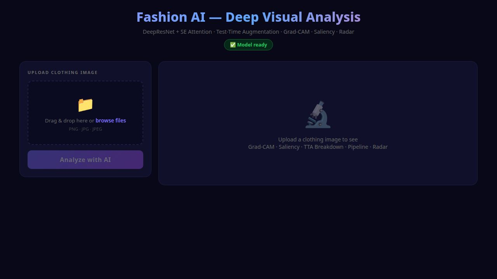

# 🧥 Fashion MNIST Pro
### Aplicație Web de Analiză Vizuală · ResNet Custom · Explainable AI (XAI) · Flask

| | |
|---|---|
| 👤 **Autor** | Mocanu Roberto |
| 🏷️ **Domeniu** | Computer Vision / Deep Learning / Explainable AI |
| 📦 **Framework** | TensorFlow 2.x · Keras 3 · Flask · OpenCV |
| 🗂️ **Dataset** | Fashion MNIST (70.000 imagini, 10 clase) |
| 🌐 **Interfață** | Aplicație Web Flask cu analiză vizuală completă |

Acest proiect reprezintă **un pipeline complet de Computer Vision cu interfață web interactivă**, construit de la zero pe arhitectură reziduală (ResNet). Spre deosebire de soluțiile clasice cu CNN secvențial, propune **preprocesare inteligentă a imaginilor**, **Test-Time Augmentation (TTA)** pentru acuratețe maximă, și un suite complet de **Explainable AI (XAI)** cu Grad-CAM, hărți de saliency, vizualizare pipeline și analiză radar — toate disponibile în timp real prin interfața web.

---

## 🖥️ Interfața Web — Demonstrație Live


*Interfața dark-themed cu upload drag-and-drop, predicție top-3, și 5 tab-uri de analiză vizuală*

### Funcționalități Interfață

| Tab | Conținut |
|---|---|
| **Pipeline** | Toți pașii de preprocesare vizualizați: Original → Grayscale → Corecție fundal → CLAHE → 28×28 |
| **Grad-CAM** | Heatmap suprapus pe imagine — zonele roșii indică ce a "văzut" modelul |
| **Saliency** | Importanța fiecărui pixel individual față de decizia finală |
| **Confidence** | Heatmap + grafic radar pentru toate cele 10 clase simultan |
| **TTA** | Cele 8 variante de augmentare vizualizate, cu grafic de predicții mediate |

---

## 📁 Structura Proiectului

```
fashion_mnist_pro/
│
├── web_app.py                   # Aplicația Flask — server principal
├── retrain.py                   # Script reantrenare model îmbunătățit
│
├── models/
│   └── resnet_model.keras       # Modelul antrenat, gata de inferență
│
├── outputs/
│   ├── confusion_matrix.png     # Matricea de confuzie (10.000 imagini)
│   ├── gradcam_heatmap.png      # Harta termică Grad-CAM (XAI)
│   └── web_app_screenshot.jpg   # Captură interfață web
│
├── templates/
│   └── index.html               # Frontend dark-themed cu tabs vizuale
│
├── data/
│   ├── X_train.npy / y_train.npy
│   └── X_test.npy  / y_test.npy
│
├── fashion_mnist_pro.ipynb      # Notebook prezentare academică
└── README.md
```

---

## 🧠 1. Arhitectura Modelului: ResNet Custom

### De ce Skip Connections?

Într-o rețea neurală adâncă, informația se poate pierde treptat pe măsură ce trece prin zeci de straturi de convoluție — fenomen cunoscut drept **Vanishing Gradient Problem**.

Soluția: blocuri de tip `ResidualBlock` cu **Skip Connections** care adună intrarea originală la ieșirea prelucrată:

```
Output = ReLU( F(x) + x )
```

Gradientul matematic poate astfel "zbura" nealterat prin rețea în timpul Backpropagation, permițând antrenarea unor rețele mult mai adânci și mai precise.

| Caracteristică | CNN Clasic | ResNet Custom (al nostru) |
|---|---|---|
| Skip Connections | ❌ | ✅ |
| Batch Normalization | Opțional | ✅ Per bloc |
| GlobalAveragePooling | Rar | ✅ (reduce overfitting) |
| Risc Vanishing Gradient | 🔴 Mare | 🟢 Minim |

### Implementare ResidualBlock

```python
class ResidualBlock(layers.Layer):
    def __init__(self, filters, stride=1, **kwargs):
        super().__init__(**kwargs)
        self.conv1 = layers.Conv2D(filters, 3, strides=stride, padding='same', use_bias=False)
        self.bn1   = layers.BatchNormalization()
        self.conv2 = layers.Conv2D(filters, 3, padding='same', use_bias=False)
        self.bn2   = layers.BatchNormalization()
        if stride != 1:
            self.shortcut_conv = layers.Conv2D(filters, 1, strides=stride, use_bias=False)
            self.shortcut_bn   = layers.BatchNormalization()

    def call(self, inputs, training=False):
        x = tf.nn.relu(self.bn1(self.conv1(inputs), training=training))
        x = self.bn2(self.conv2(x), training=training)
        shortcut = self.shortcut_bn(self.shortcut_conv(inputs), training=training) \
                   if self.stride != 1 else inputs
        return tf.nn.relu(x + shortcut)
```

---

## ⚙️ 2. Preprocesare Inteligentă a Imaginilor

Una dintre inovațiile principale ale acestui proiect este **pipeline-ul de preprocesare automată**, care transformă orice fotografie reală a unui articol vestimentar în formatul optim pentru model.

### Pașii Pipeline-ului

```
[Imagine Originală]
       ↓
[Conversie Grayscale]
       ↓
[Detecție Automată Fundal]  ← Analizează colțurile imaginii
       ↓                        Dacă fundalul > 127 → inversare automată
[Contrast CLAHE]            ← Îmbunătățire locală (4×4 tiles, clipLimit=3.0)
       ↓
[Crop Bounding-Box]         ← Detectează articolul, taie margini goale
       ↓
[Square Pad + Resize 28×28] ← Centrare fără distorsiune
```

### De ce CLAHE?

**CLAHE** (Contrast Limited Adaptive Histogram Equalization) îmbunătățește contrastul *local*, nu global — astfel texturile subtile (dantelă, tricot, piele) devin vizibile pentru rețea fără a satura zonele deja clare.

```python
clahe = cv2.createCLAHE(clipLimit=3.0, tileGridSize=(4, 4))
enhanced = clahe.apply(gray_image)
```

---

## 🔁 3. Test-Time Augmentation (TTA)

**TTA** reduce erorile aleatoare prin rularea modelului pe **8 variante** ale aceleiași imagini și medierea predicțiilor:

| Variantă | Transformare |
|---|---|
| 0 | Original |
| 1 | Flip orizontal |
| 2 | Luminozitate +10% |
| 3 | Luminozitate −10% |
| 4 | Deplasare jos 1px |
| 5 | Deplasare sus 1px |
| 6 | Deplasare dreapta 1px |
| 7 | Deplasare stânga 1px |

```python
final_prediction = np.mean([model.predict(variant) for variant in 8_variants], axis=0)
```

Rezultat: predicție mai stabilă și mai puțin sensibilă la variațiile minore de poziționare sau iluminare.

---

## 📊 4. Evaluarea Performanței — Confusion Matrix


*Matricea de Confuzie — Evaluare pe 10.000 imagini nevăzute din Fashion MNIST*

Acuratețea globală nu spune totul. **Matricea de Confuzie** dezvăluie exact unde modelul greșește — de exemplu, confuzia frecventă între `Shirt` și `T-shirt/top` sau `Coat` și `Pullover`, clase vizual similare.

Fiecare rând = **clasa reală (Ground Truth)** · Fiecare coloană = **predicția rețelei** · Diagonala = predicții corecte.

---

## 👁️ 5. Transparență Algoritmică — Explainable AI cu Grad-CAM

> **Problema „Black Box"**: Cum știm că modelul recunoaște o gheată uitându-se la *forma ei*, și nu la fundalul imaginii?


*Analiza XAI Grad-CAM — Zonele Roșii/Galbene indică focusul rețelei neurale*

Tehnica **Grad-CAM** (Gradient-weighted Class Activation Mapping) calculează gradienții față de ultimul strat convoluțional și generează o hartă termică:

- 🔴 **Roșu/Portocaliu** — zona cu cel mai mare impact asupra deciziei
- 🔵 **Albastru/Violet** — zone ignorate în procesul de clasificare

### Implementare Grad-CAM (Hook-Based pentru Custom Layers)

Provocare tehnică: Keras 3 nu expune direct `output_shape` pentru layere custom (subclassed). Soluția implementată folosește un **forward hook** care captează feature map-ul în timpul pasului forward, în interiorul contextului `GradientTape`:

```python
# Hook pe layer-ul țintă (cel dinaintea GlobalAveragePooling2D)
captured = []
original_call = hook_layer.__class__.__call__

def hooked_call(self_layer, inputs, *args, **kwargs):
    out = original_call(self_layer, inputs, *args, **kwargs)
    if self_layer is hook_layer:
        captured.append(out)   # captăm feature map-ul
    return out

hook_layer.__class__.__call__ = hooked_call

x = tf.Variable(img_array)
with tf.GradientTape() as tape:
    preds = model(x, training=False)
    score = preds[:, pred_class_idx]

grads = tape.gradient(score, captured[0])  # ∂score/∂feature_map
```

---

## 🏁 6. Concluzii Executive

| # | Aspect | Detaliu |
|---|---|---|
| 1 | **Arhitectură Avansată** | ResNet cu Skip Connections combate Vanishing Gradient — acuratețe superioară față de CNN clasic |
| 2 | **Preprocesare Inteligentă** | CLAHE + detecție automată fundal + crop bounding-box — funcționează cu orice fotografie reală |
| 3 | **Robustețe prin TTA** | 8 variante de augmentare mediate la inferență — predicții mai stabile și mai precise |
| 4 | **Transparență XAI** | Grad-CAM (hook-based) + Saliency Maps dovedesc că modelul înțelege forma, nu fundalul |
| 5 | **Interfață Web Completă** | Flask app cu 5 tab-uri de analiză vizuală — demonstrabil imediat, fără configurare locală |
| 6 | **Reproductibilitate** | Modelul, codul și vizualizările sunt versionizate pe GitHub |

> 💡 *Pipeline-ul este pregătit pentru deployment cloud (Gunicorn + autoscale). Arhitectura reziduală custom poate fi extinsă cu ușurință pentru orice dataset de Computer Vision.*

---

## 🚀 Cum Rulezi Proiectul

```bash
# 1. Clonează repository-ul
git clone https://github.com/MRoberto25/fashion_mnist_pro.git
cd fashion_mnist_pro

# 2. Instalează dependențele
pip install tensorflow keras flask opencv-python-headless matplotlib seaborn pillow numpy

# 3. Pornește aplicația web
python web_app.py

# 4. Deschide în browser
# http://localhost:5000
```

### Reantrenare Model (opțional)

```bash
# Antrenează un model îmbunătățit (15 epochs, augmentare, label smoothing)
python retrain.py
# Modelul nou se salvează automat în models/resnet_model.keras
```

---

<p align="center">Dezvoltat de <strong>Mocanu Roberto</strong> · Computer Vision / Deep Learning / Explainable AI</p>
