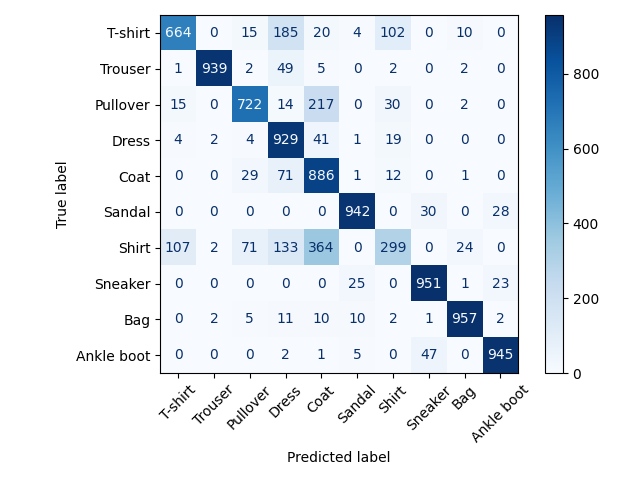
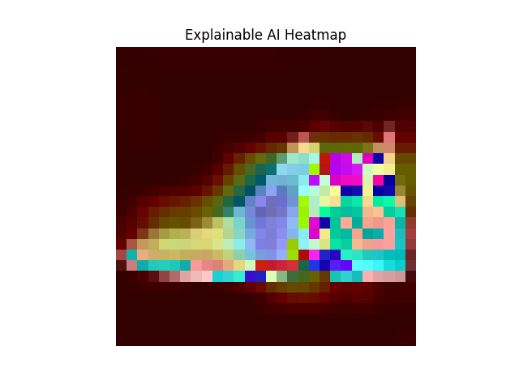

# 🧥 Fashion MNIST Pro
### End-to-End MLOps Pipeline · Custom ResNet · Explainable AI (XAI)

| | |
|---|---|
| 👤 **Autor** | Mocanu Roberto |
| 🏷️ **Domeniu** | Computer Vision / Deep Learning / MLOps |
| 📦 **Framework** | TensorFlow / Keras |
| 🗂️ **Dataset** | Fashion MNIST (70,000 imagini, 10 clase) |

Acest proiect reprezintă **stadiul final de Inferență & Evaluare** al unui pipeline MLOps modular. Spre deosebire de abordările clasice cu CNN secvențial, propune o **Arhitectură Reziduală (ResNet) construită de la zero**, optimizată pentru a combate *Vanishing Gradient Problem* și a îmbunătăți acuratețea pe articole de îmbrăcăminte similare vizual.

---

## 📁 Structura Proiectului

```
fashion_mnist_pro/
│
├── models/
│   └── resnet_model.keras       # Modelul antrenat, gata de inferență
│
├── outputs/
│   ├── confusion_matrix.png     # Matricea de confuzie (10.000 imagini)
│   └── gradcam_heatmap.png      # Harta termică Grad-CAM (XAI)
│
├── fashion_mnist_pro.ipynb      # Notebook principal de prezentare
└── README.md
```

---

## 🧠 1. Arhitectura Modelului: ResNet Custom

### De ce Skip Connections?

Într-o rețea neurală adâncă, informația se poate pierde treptat pe măsură ce trece prin zeci de straturi de convoluție — fenomen cunoscut drept **Vanishing Gradient Problem**.

Soluția: blocuri de tip `ResidualBlock` cu **Skip Connections** care adună intrarea originală la ieșirea prelucrată:

```
Output = ReLU( F(x) + x )
```

Gradientul matematic poate astfel "zbura" nealterat prin rețea în timpul Backpropagation, permițând antrenarea unor rețele mult mai adânci și mai precise.

| Caracteristică | CNN Clasic | ResNet Custom (al nostru) |
|---|---|---|
| Skip Connections | ❌ | ✅ |
| Batch Normalization | Opțional | ✅ Per bloc |
| GlobalAveragePooling | Rar | ✅ (reduce overfitting) |
| Risc Vanishing Gradient | 🔴 Mare | 🟢 Minim |

### Implementare ResidualBlock

```python
class ResidualBlock(layers.Layer):
    def __init__(self, filters, stride=1, **kwargs):
        super(ResidualBlock, self).__init__(**kwargs)
        self.conv1 = layers.Conv2D(filters, 3, strides=stride, padding="same", use_bias=False)
        self.bn1   = layers.BatchNormalization()
        self.relu1 = layers.ReLU()
        self.conv2 = layers.Conv2D(filters, 3, strides=1, padding="same", use_bias=False)
        self.bn2   = layers.BatchNormalization()

        if stride != 1:
            self.shortcut_conv = layers.Conv2D(filters, 1, strides=stride, use_bias=False)
            self.shortcut_bn   = layers.BatchNormalization()

        self.add   = layers.Add()
        self.relu2 = layers.ReLU()

    def call(self, inputs, training=False):
        x = self.relu1(self.bn1(self.conv1(inputs), training=training))
        x = self.bn2(self.conv2(x), training=training)
        shortcut = self.shortcut_bn(self.shortcut_conv(inputs), training=training) \
                   if self.stride != 1 else inputs
        return self.relu2(self.add([x, shortcut]))
```

---

## 📊 2. Evaluarea Performanței — Confusion Matrix

Acuratețea globală nu spune totul. **Matricea de Confuzie** dezvăluie exact unde modelul greșește — de exemplu, confuzia frecventă între `Shirt` și `T-shirt/top` sau `Coat` și `Pullover`, clase vizual similare.

Fiecare rând reprezintă **clasa reală (Ground Truth)**, fiecare coloană reprezintă **predicția rețelei**. Valorile de pe diagonala principală sunt predicțiile corecte.


*Matricea de Confuzie — Evaluare pe 10.000 imagini nevăzute*

---

## 👁️ 3. Transparență Algoritmică — Explainable AI cu Grad-CAM

> **Problema „Black Box"**: Cum știm că modelul recunoaște o gheată uitându-se la *forma ei*, și nu la fundalul imaginii?

Tehnica **Grad-CAM** (Gradient-weighted Class Activation Mapping) calculează gradienții față de ultimul strat convoluțional și generează o hartă termică a zonelor de interes:

- 🔴 **Roșu/Portocaliu** — zona cu cel mai mare impact asupra deciziei modelului
- 🔵 **Albastru** — zone ignorate în procesul de clasificare


*Analiza XAI: Zonele Roșii indică focusul rețelei*

---

## 🎯 4. Testare Live — Inferență în Timp Real

Modelul rulează predicții pe **5 imagini complet aleatorii** din setul de test nevăzut, cu afișarea clasei prezise, clasei reale și a gradului de încredere (confidence).

```python
(_, _), (X_test, y_test) = tf.keras.datasets.fashion_mnist.load_data()
X_test_norm = np.expand_dims(X_test.astype('float32') / 255.0, axis=-1)

random_indices = np.random.choice(len(X_test), 5, replace=False)

for idx in random_indices:
    img        = X_test_norm[idx]
    pred_probs = model.predict(np.expand_dims(img, axis=0), verbose=0)
    pred_label = class_names[np.argmax(pred_probs)]
    confidence = np.max(pred_probs) * 100
```

- ✅ **Verde** — predicție corectă
- ❌ **Roșu** — predicție greșită

---

## 🏁 5. Concluzii Executive

| # | Aspect | Detaliu |
|---|---|---|
| 1 | **Modularitate** | Pipeline împărțit în `01_extract`, `02_train`, `03_evaluate` — scalabil pentru producție |
| 2 | **Arhitectură Eficientă** | `GlobalAveragePooling2D` în loc de straturi `Dense` plate — reduce masiv parametrii, previne overfitting |
| 3 | **Transparență (XAI)** | Grad-CAM dovedește că modelul a învățat marginile, textura și forma articolelor — nu pattern-uri aleatoare de pixeli |
| 4 | **Reproductibilitate** | Modelul, metricile și vizualizările sunt versionizate pe GitHub — orice experimentare e trasabilă |

> 💡 *Acest pipeline este pregătit pentru deployment într-un **API web (FastAPI/Flask)** sau pe **dispozitive Edge** (TFLite). Arhitectura reziduală custom poate fi extinsă cu ușurință pentru alte seturi de date din domeniul Computer Vision.*

---

## 🚀 Cum Rulezi Proiectul

```bash
# 1. Clonează repository-ul
git clone https://github.com/MRoberto25/fashion_mnist_pro.git
cd fashion_mnist_pro

# 2. Instalează dependențele
pip install tensorflow numpy matplotlib

# 3. Deschide notebook-ul
jupyter notebook fashion_mnist_pro.ipynb
```

---

<p align="center">Dezvoltat de <strong>Mocanu Roberto</strong> · Computer Vision / Deep Learning</p>
